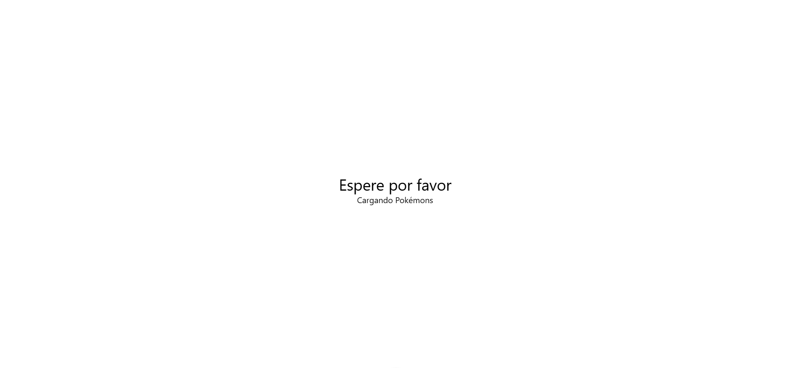

<div align="center">

# ***_Whos That Pokemon_***


</div>

<div align="justify">

## **Índice**
- [Preguntas](#preguntas)
  - [Pregunta 1](#p1)
  - [Pregunta 2](#p2)
  - [Pregunta 3](#p3)
  - [Pregunta 4](#p4)
- [Reto 1](#reto1)
  - [Paso 1](#1)
  - [Paso 2](#2)
  - [Paso 3](#3)
- [Reto 2](#reto2)
  - [Paso 1](#2.1)
  - [Paso 2](#2.2)
- [Reto 3](#reto3)
  - [Paso 1](#3.1)
  - [Paso 2](#3.2)
- [Reto 4](#reto4)
  - [Paso 1](4.1)

<div align="center">
   
 
     
</div>

___

## **Preguntas** <a name="preguntas"></a>
## **Reto 1**
- ### *¿Para qué sirve Vue Router, Pinia, Vitest, ESLint y Prettier?* <a name="p1"></a>
- ### *¿Qué es Composition API y en qué se diferencia de Option API en VueJS?* <a name="p2"></a>
- ### *¿Qué es screaming architecture y qué ventajas tiene?* <a name="p3"></a>

- ### *¿Cómo le indicamos a Vue que usaremos TS en vez de JS?*<a name="p4"></a>

## **Reto 2**
- ### *¿Para qué sirven las [clases](#2.1) que hemos añadido?* <a name="p5"></a>

- ### *Saca una captura de como se ve actualmente nuestra aplicación. ¿No ves los cambios? Algo se te olvida... ¿qué es? Indica los archivos que has tenido que modificar.* <a name="p6"></a>
  Hay que modificar el archivo `App.vue` e indicar la pantalla que queremos que se vea, en este caso `PokemonGame.vue`

- ### *Utilizando una directiva de VueJS, ¿cómo ocultaríamos [esta](#2.1) sección por completo?* <a name="p7"></a>

- ### *¿Para qué crees que sirven? ¿Te aventuras a intentar averiguar cual será la lógica que implementemos en ellos?* <a name="p8"></a>

## **Reto 1** <a name="reto1"></a>
  - ### *Paso 1: Crear el proyecto Vue* <a name="1"></a>
    Siguiendo el siguiente comando creamos el proyecto Vue:
    ```bash
    npm create vue@latest
    ```
    Y a continuacion seleccionamos las siguientes opciones:  
    

    Nuestro Pokemon Game lo vamos a realizar siguiendo [Composition API](#p2) y además, nuestra estructura de archivos va a estar basada en [screaming architecture.](#p3)

 - ### *Paso 2: Modificar el proyecto base de Vue* <a name="2"></a>
    - Borrar el contenido de App.vue y deja la estructura básica de VueJS teniendo en cuenta que usaremos Composition API. Recuerda que vamos a utilizar TS en lugar de JS.

    - Añadir un mensaje "Hello World" a App.vue

    - En la carpeta de assets, borra los archivos base.css y logo.svg

    - Cambia el nombre de main.css de la carpeta assets a styles.css y modifica la ruta en el archivo main.ts para que funcione correctamente nuestra hoja de estilo.

    - Ejecuta el comando npm run dev y muestra el resultado.
    
 
 - ### *Paso 3: Configurar Tailwind CSS* <a name="3"></a>
    - Configura el proyecto para hacer uso de Tailwind CSS. Consulta la documentación oficial y aplica los cambios donde sea necesario tal y como se indica. 

        - Instalar Tailwind via npm
        ```bash
        npm install -D tailwindcss@latest postcss@latest autoprefixer@latest
        ```

        - Crear los ficheros de configuracion
        ```bash
        npx tailwindcss init -p
        ```

        - Incluir Tailwind al CSS (styles.css)
        ```css
        @tailwind base;
        @tailwind components;
        @tailwind utilities;
        ```

</div>
<div align="center">
  
</div>

<div align="justify">

  ## **Reto 2** <a name="reto2"></a>
  - ### *Paso 1: Creando secciones en PokemonGame.vue* <a name="2.1"></a>
    Usando la etiqueta `<section>` de HTML, vamos a dividir nuestro template. Tendremos:
    Una sección que tenga un mensaje que indique al usuario que: Espere por favor y Cargando Pokémons. De tal manera que:
    ```html
    <section class="flex flex-col justify-center items-center w-screen h-screen">
        <h1 class="text-3xl">Espere por favor</h1>
        <h3 class="animate-pulse">Cargando Pokémons</h3>
    </section>
    ```

    

  - ### *Paso 2: Añadir nueva seccion* <a name="2.2"></a>
   Ahora, vamos a crear otra nueva sección igual a la anterior pero que muestre al usuario el mensaje: ¿Cuál es este Pokémon?
   ```html
   <section class="flex flex-col justify-center items-center w-screen h-screen">
        <h1 class="text-3xl">¿Cual es este Pokémon?</h1>
    </section>
   ```

## **Reto 3** <a name="reto3"></a>
- ### *Paso 1: Creando PokemonPicture.vue* <a name="3.1"></a>
  - Lo que vamos a hacer en este componente es importar directamente desde PokeApi una imagen de un pokemon (Ditto para ser más exactos).
  - Siguiendo la misma forma que en PokemonGame.vue de las secciones, en este componente nos crearemos una sección que contendrá una imagen del pokemon Ditto. (No es necesario realizar la conexión directamente a la API, copia y pega la url de la imagen y muéstrala).
  - El resultado de todos los pasos anteriores debe ser el siguiente:

  

  - Ahora bien, nosotros queremos que inicialmente la imagen de nuestro Pokémon esté completamente oculta como en la imagen del resultado final, ¿cómo hacemos esto? utilizando una clase de Tailwind CSS llamada brightness-0. Comprueba que la imagen de tu Pokémon ahora mismo esté completamente negra. Añade también la clase h-[200px] que nos sirve para poner a la imagen una altura de 200px

  

- ### *Paso 2: Creando PokemonOptions.vue* <a name="3.2"></a>
  - En una nueva sección vamos a "simular" lo que serían las opciones de los Pokémon. Esto lo vas a hacer creando una lista de HTML tal y como se muestra en la imagen final. 

    

  - Ahora, mediante clases css de tailwind, dale aspecto de botones a esa lista.

  - El color de fondo de nuestra aplicación es: #f1f1f1, para aplicarlo, ¿dónde debes colocar el código css correspondiente? aplícalo y muestra los cambios.   
  Colocamos el siguiente codigo en el `style` de `App.vue`
  ```css
  :global(body) {
  background-color: #f1f1f1;
  }
  ```

  

## **Reto 4** <a name="reto4"></a>
- ### **Paso 1: Conectando a la pokeapi** <a name="4.1"></a>
  - En primer lugar vamos a crear un archivo que vamos a llamar usePokemonGame.ts dentro de la carpeta de composables.
  - Nuestro juego va a tener 3 estados: gana, pierde y jugando. Estos estados los vamos a almacenar en una propiedad reactiva. Como vamos a tener que usar estos estados, lo mejor va a ser que nos creemos una interfaz. Para ello, dentro de la carpeta pokemon vamos a crear una nueva llamada interfaces, y en él crearemos un archivo llamado game-status.enum.ts. Aunque técnicamente la enumeración no cuenta como una interfaz en sí, vamos a crearlo de esta manera. El contenido de este archivo es el siguiente:
  ```ts
  export enum GameStatus {
    Playing = 'playing',
    Won = 'won',
    Lost = 'lost'
  }
  ```
  - Ahora, crearemos un nuevo archivo llamado index.ts que será nuestro archivo de barril (archivo que exporta varios modulos desde una carpeta). 
  ```ts
  export * from './game-status.enum';
  ```
  - Volvemos a nuestro archivo usePokemonGame.ts:
  ```ts
  import { onMounted, ref } from 'vue';
  import { GameStatus } from '../interfaces';
  import axios from 'axios'

  export const usePokemonGame = () => {
    const gameStatus = ref<GameStatus>(GameStatus.Playing);
    const api = "https://pokeapi.co/api/v2/pokemon"

    const getPokemons = async () => {
      const response = await axios.get(api+"/?limit=151");
      
      console.log(response.data);
    }

    onMounted(() => {
      getPokemons();
    })

    return {
      gameStatus,
    };
  }
  ```

  - Comprueba que funciona  y muestra el resultado de la consola de la aplicación

   
  - Los datos que hemos obtenido no son técnicamente los que nos interesan, ya que solo necesitamos el id y el nombre de los Pokemon. Por tanto, lo que vamos a hacer es crear un tipado estricto para que podamos tipar los resultados de las peticiones HTTP que hagamos a la API de Pokemon para ello creamos el fichero `pokemon-list-response.ts` con los tipos de las respuestas de la api y los exportamos en nuestro archivo de barril.   


  

## **Reto 5** <a name="reto5"></a>
- ### **Paso 1: Creando nuestro propio tipo**<a name="5.1"></a>
    - Vamos a modificar el método getPokemons que hemos creado en el archivo usePokemonGame.ts para quedarnos solo con el nombre y el id de la respuesta
    - Exportálo de la misma forma que hemos hecho con los archivos hasta ahora. Volvamos a usePokemonGame.ts. Importamos la interfaz que acabamos de crear

    ```ts
    const pokemonsArray = response.data.results.map( pokemon => {
        const urlParts = pokemon.url.split("/");
        const id = urlParts[urlParts.length - 2] ?? 0;
        return {
            name : pokemon.name,
            id: +id
        }
      })

      return pokemonsArray;
    ```
    - ¿Qué es lo que estamos haciendo? ¿Para qué sirve la línea de código: const id = urlParts[urlParts.length - 2] ?? 0;?   

      Esta linea nos permite tomar la id desde la url del pokemon siendo que separamos el texto entre los `/` de la url y tomamos la posicion en la que esta su id, en caso de que esto falle decimos que tiene la id 0.
    
      

- ### **Paso 2: Randomizar la lista devuelta** <a name="5.2"></a>
  - El resultado ahora nos muestra una lista de los 151 pokemons ordenados según su id. Nosotros NO queremos que estén ordenados los pokemons, por tanto, vamos a hacer que nuestra lista nos la devuelva de forma aleatoria, ¿se te ocurre cómo?
  
  En vez de devolver la lista hacemos el siguiente return:
  ```ts
  return pokemonsArray.sort(() => {return 0.5 - Math.random();});
  ```

  
</div>